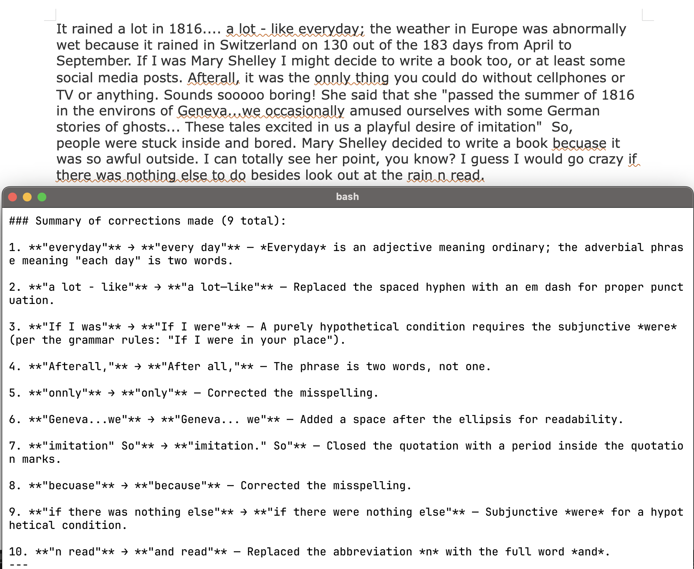

# proofreader.py

Simple grammar proofreader agent using the the
LanguageTool protocol.  

## Setup - LibreOffice

To use it in LibreOffice enable LanguageTool 
support under Preferences > Languages and Locales > Writing Aids (enable
LanguageTools) and LanguageTool server settings (set base url to
http://127.0.0.1:8081).  (There is also a extension for Chrome. But its
"async" protocol is a bit different so it is not supported yet.)

## Python Installation

The server is a python script so either pip install
litellm and run it or use "uv":

```
$ uv run --with litellm python proofreader.py
```

## Model

To set the model, the first tag before the model is
the provider.  If you want to use OpenRouter make sure your 
OpenRouter api key environment variable is set.  Same goes for
anthropic.  If you are using ollama, use ollama as the
provider, eg. ollama/qwen3.5:4b, and have the environment
variable OLLAMA_API_BASE set to your server, eg http://localhost:11434.
Use a cheap model since this server will call your LLM 
constantly (though not in parallel).  

## Special Notes

Since LibreOffice enforces a timeout when calling the server,
the LLM is called in the background.  To get the latest grammar checks
the server needs to be called again.  Since adding spaces at the
end of your paragraph does not trigger the agent code, just add or
delete spaces at the end until the server is called.

## Usage

```
usage: proofreader.py [-h] [--host HOST] [--port PORT] [--model MODEL]

LanguageTool Server using LLM to check grammar

options:
  -h, --help     show this help message and exit
  --host HOST    host to serve. (default: 127.0.0.1)
  --port PORT    port to serve. (default: 8081)
  --model MODEL  prefix with provider. (default:
                 openrouter/deepseek/deepseek-v4-flash)
```


